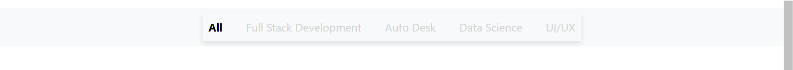
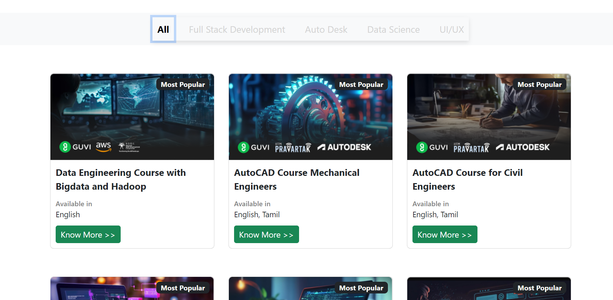
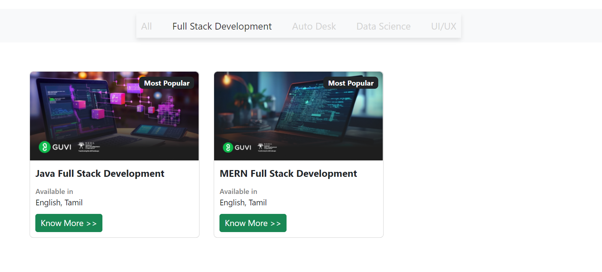

> # React-Router-Task

This repository is for React Vite Project for React Router Task.

---

&nbsp;

The Navigation Bar listing the category of courses available, like All , Full stack development, Auto Desk, Data science , UI/UX As Navigation menu.

The selected item will be in normal text and the color of other options listed in the NavBar will be in lighter text.

---

As default the All option will be selected and all the courses will be rendered as in the below screenshot.

---

When clicked on the Listed items on NavBar, the respective courses will be rendered. For reference, screenshot for Fullstack is attached below.

